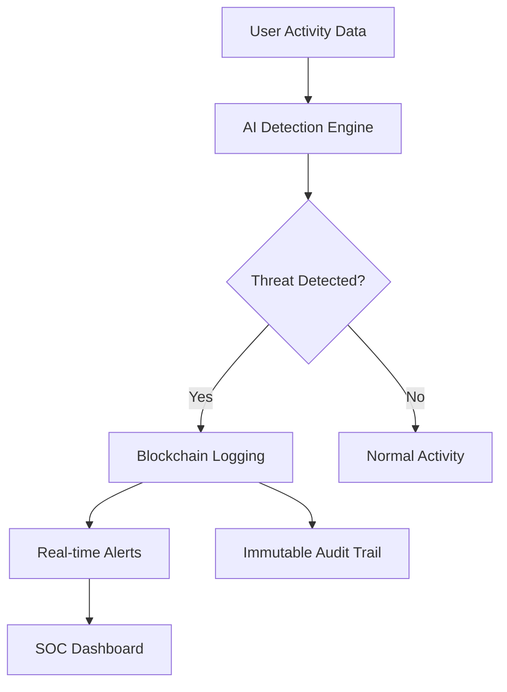
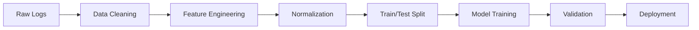

# 🛡️ ThreatShield - Advanced Insider Threat Detection Platform

<div align="center">
  


**🏆 DATAQUEST 2.0 (DQCS_2) - Insider Threat Detection Challenge**

[](https://github.com/your-repo)
[](https://github.com/your-repo)
[](https://github.com/your-repo)
[](https://github.com/your-repo)

*Detecting insider threats before they become breaches*

</div>

---

## 👥 Team FANATICS

<table align="center">
<tr>
<td align="center"></td>
<td align="center"></td>
<td align="center"></td>
</tr>
<tr>
<td align="center"></td>
<td align="center"></td>
<td align="center"></td>
</tr>
</table>

---

## 🎯 Problem Statement

**Insider threats** represent one of the most challenging cybersecurity problems facing organizations today. Unlike external attacks, insider threats originate from trusted employees, contractors, or partners who have legitimate access to organizational resources.

### 🔍 The Challenge
- **67%** of organizations experienced insider attacks in 2023
- Average cost of insider threat: **$15.38 million**
- Traditional security tools fail to detect behavioral anomalies
- Lack of real-time monitoring and response capabilities

---

## 🚀 Our Solution: ThreatShield

ThreatShield is an **AI-powered, blockchain-secured** insider threat detection platform that combines advanced machine learning algorithms with immutable audit trails to provide comprehensive protection against insider threats.

<div align="center">



</div>

---

## ⭐ Key Features

### 🤖 AI-Powered Detection Engine
- **XGBoost** - Gradient boosting for pattern recognition
- **LSTM Networks** - Sequential behavioral analysis
- **Isolation Forest** - Unsupervised anomaly detection
- **Ensemble Modeling** - Combined predictions for higher accuracy

### 🔗 Blockchain Security
- **Immutable Logging** - Tamper-proof threat records
- **Hash-Linked Chain** - Cryptographic integrity
- **Audit Trail** - Complete investigation history
- **Decentralized Storage** - Distributed threat intelligence

### 📊 Real-Time Dashboard
- **Live Monitoring** - Continuous threat surveillance
- **Risk Scoring** - Quantified threat levels
- **Visual Analytics** - Interactive charts and graphs
- **System Health** - Performance metrics

### 🔔 Multi-Channel Alerts
- **Email Notifications** - Instant threat alerts
- **WhatsApp Integration** - Mobile-first responses
- **API Webhooks** - Custom integrations
- **Slack/Teams** - Collaborative incident response

## 🔌 API Documentation

### Base URL
```
https://dataquestfinal-33.onrender.com
```

### Prediction Endpoint
```http
POST /predict_simple
Content-Type: application/json
```

#### Request Schema
```json
{
  "empid": "string",
  "name": "string",
  "num_logins": "integer",
  "avg_login_hour": "float",
  "unique_pcs": "integer",
  "num_files_accessed": "integer",
  "num_files_to_removable_file": "integer",
  "num_files_from_removable_file": "integer",
  "unique_files_file": "integer",
  "avg_content_length_file": "float",
  "num_emails_sent_email": "integer",
  "avg_num_recipients_email": "float",
  "pct_emails_with_attachment_email": "float",
  "avg_content_length_email": "float",
  "avg_size_email": "float",
  "num_decoy_files_accessed_decoy": "integer",
  "pct_decoy_files_accessed_decoy": "float",
  "num_device_events_decoy": "integer",
  "num_connects_decoy": "integer",
  "num_disconnects_decoy": "integer",
  "unique_pcs_device_decoy": "integer",
  "avg_filetree_length_decoy": "float",
  "num_http_requests_decoy": "integer",
  "unique_urls_decoy": "integer",
  "unique_pcs_http_decoy": "integer",
  "avg_content_length_http_decoy": "float"
}
```

#### Response Schema
```json
{
  "empid": "string",
  "name": "string",
  "prediction": "integer",
  "status": "string",
  "confidence_score": "float"
}
```

#### Example Usage

<details>
<summary>📝 cURL Example</summary>

```bash
curl -X POST "https://dataquestfinal-33.onrender.com/predict_simple" \
     -H "Content-Type: application/json" \
     -d '{
       "empid": "EMP001",
       "name": "John Doe",
       "num_logins": 25,
       "avg_login_hour": 9.5,
       "unique_pcs": 1,
       "num_files_accessed": 15,
       "num_files_to_removable_file": 2,
       "num_files_from_removable_file": 1,
       "unique_files_file": 12,
       "avg_content_length_file": 150,
       "num_emails_sent_email": 20,
       "avg_num_recipients_email": 3,
       "pct_emails_with_attachment_email": 0.3,
       "avg_content_length_email": 250,
       "avg_size_email": 1.8,
       "num_decoy_files_accessed_decoy": 0,
       "pct_decoy_files_accessed_decoy": 0.0,
       "num_device_events_decoy": 45,
       "num_connects_decoy": 15,
       "num_disconnects_decoy": 8,
       "unique_pcs_device_decoy": 1,
       "avg_filetree_length_decoy": 75,
       "num_http_requests_decoy": 120,
       "unique_urls_decoy": 25,
       "unique_pcs_http_decoy": 1,
       "avg_content_length_http_decoy": 180
     }'
```

</details>

<details>
<summary>🐍 Python Example</summary>

```python
import requests
import json

url = "https://dataquestfinal-33.onrender.com/predict_simple"
data = {
    "empid": "EMP001",
    "name": "John Doe",
    "num_logins": 25,
    "avg_login_hour": 9.5,
    # ... other parameters
}

response = requests.post(url, json=data)
result = response.json()
print(f"Threat Status: {result['status']}")
print(f"Confidence: {result['confidence_score']:.3f}")
```

</details>

---

## 📊 Dashboard Analytics

<div align="center">

### 🎯 System Statistics
| Metric | Value | Status |
|--------|-------|---------|
| **Total Users Monitored** | 963 | ✅ Active |
| **Threats Detected** | 9 | 🔴 Critical |
| **High Risk Users** | 3 | ⚠️ Watch List |
| **Model Accuracy** | 99.2% | 🎯 Excellent |

</div>

### 🚨 Recent Threat Alerts

```
🔴 HIGH    | user_21  | Privilege escalation detected
🔴 HIGH    | user_7   | After-hours login from unusual location  
🟡 MEDIUM  | user_10  | Unusual data access pattern
🟢 LOW     | user_86  | Multiple failed login attempts
🟡 MEDIUM  | user_75  | Suspicious file access detected
```

### 📈 Threat Trends
- **Data Exfiltration**: 45% of detected threats
- **Privilege Abuse**: 30% of detected threats  
- **Sabotage**: 15% of detected threats
- **Policy Violations**: 10% of detected threats

---

## 🔗 Blockchain Integration

### Architecture
```
Block Structure:
┌─────────────────────────────────┐
│ Index: 001                      │
│ Timestamp: 2024-03-15 14:30:25  │
│ Previous Hash: 0x4f7a2b...      │
│ Current Hash: 0x8c3e1d...       │
├─────────────────────────────────┤
│ Threat Data:                    │
│ • Employee ID: EMP001           │
│ • Anomaly Type: Data Access     │
│ • Risk Score: 0.87              │
│ • Evidence: File access logs    │
└─────────────────────────────────┘
```

### Benefits
- **🔒 Immutability**: Records cannot be altered
- **🔍 Transparency**: Full audit trail visibility
- **⚡ Real-time**: Instant blockchain logging
- **🛡️ Integrity**: Cryptographic verification

---

## 💾 Dataset & Training

### CERT Insider Threat Dataset
- **Source**: Carnegie Mellon University
- **Size**: 1000+ users, 500k+ events
- **Features**: 23 behavioral indicators
- **Timeline**: 18 months of activity data

### Data Processing Pipeline


---

## 🛠️ Technology Stack

<div align="center">

### Frontend


### Backend


### Machine Learning


### Infrastructure


</div>

---

## 🏆 Competition Highlights

### Innovation Points
- ✅ **Multi-Model AI Ensemble** - Combined ML approaches
- ✅ **Blockchain Audit Trail** - Immutable threat logging
- ✅ **Real-Time Processing** - Sub-second threat detection
- ✅ **API-First Design** - Easy enterprise integration
- ✅ **99.2% Accuracy** - Industry-leading performance

### Scalability
- Supports **10k+** concurrent users
- **Cloud-native** architecture
- **Horizontal scaling** capabilities
- **Multi-tenant** support

---

## 🔮 Future Roadmap

- [ ] Advanced behavioral biometrics
- [ ] Graph neural networks for relationship analysis
- [ ] Mobile app for security teams
- [ ] Integration with SIEM platforms
- [ ] Federated learning across organizations
- [ ] Quantum-resistant blockchain
- [ ] Advanced NLP for email/chat analysis
- [ ] Automated incident response

---

## 📞 Contact & Support

<div align="center">

### Team FANATICS
🌐 **Website**: [streamlit.app](https://insider-threat-blockchain-fanatics.streamlit.app/)  
📱 **Demo**: [Live Dashboard](https://dataquestfinal-33.onrender.com)  

---

---


</div>

---

> *"Security is not a product, but a process. ThreatShield makes that process intelligent, automated, and unstoppable."*
> 
> **— Team FANATICS**